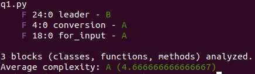
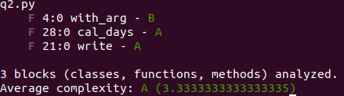
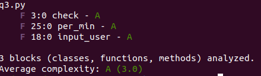

# Assignment 3c:
## LINK : https://github.com/mudit1998/SSD_Assignment_3A
### I had done all my code on ubuntu 20.04  and used VS code as editor.
### Used python3
### Output for q2 is in `output_2.txt` and for q3 is in `output_3.txt`
## q1:(CHANGES FROM 3b: Since my code doesn't have any function , so just created functions in order to calculate cyclomatic complexity. `conversion()` from line 4 to 17 , `for_input()` from line 18 to 23 and `leader()` from 24 to 43. All the code is prevously only present just divided code into functions.)
### * Taken name(id) as `integer`in json as mentioned in question as it should be in range `001-999`
### * If any of the input is of `level 0` then output shown would be `leader not found`
### * In all other cases , found the `closest leader` which is common among them.
### * First input is number of employee for which we have to find our leader and the other are the employee id's.
### * All input are taken from `input()` only as specified.

## q2:(CHANGES FROM 3b: Made functions as `with_arg()` from line 4 to 19 , `write()` from line 21 to 26 and `cal_days(d,m,y)` from line 28 to 35 and just call these functions where these were written previously)
### * Taken input from `date_calculator.txt` and found the `absolute` difference in days among them.
### * Command line argument is provided to specify that our format is  `dd/mm/yyyy` or `mm/dd/yyyy` and for other case `no command line` argument will be provided.
### * For one of the input format  used `3 letters of words` for every month.
### * Used `import sys` for getting command line argument.

## q3:(CHANGES FROM 3b: Made functions as `check()` from line 4 to 16 , `input_user()` from line 18 to 24 and `per_min()` from line 25 to 37 and just call these functions where the codes in it is written previously)
### * Seperate `employee folder` is created and all the `employee text files` are contained in it.
### * Converted in `json format` and then parse json.
### * For time from 9 to 1(excluding 1) input is taken as  for example `09:00AM` and for 1 to 5 it is taken as `1:00PM` like this.
### * If `Dates` are not equal in input format then simply output in file that `no slot since dates are different`
### * Used `import os` for getting all files from our new directory `employee`.

 

